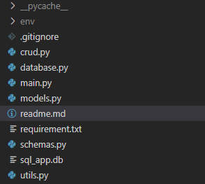

Create a database URL for SQLAlchemy

`SQLALCHEMY_DATABASE_URL = "sqlite:///./sql_app.db"`

Each instance of the SessionLocal class will be a database session. The class itself is not a database session yet.

But once we create an instance of the SessionLocal class, this instance will be the actual database session.

We name it SessionLocal to distinguish it from the Session we are importing from SQLAlchemy.

We will use Session (the one imported from SQLAlchemy) later.

`SessionLocal = sessionmaker(autocommit=False, autoflush=False, bind=engine)`

we will use the function `declarative_base()` that returns a class.
`Base = declarative_base()`

Pydantic models (schemas) that will be used when reading data, when returning it from the API. Schema.py file hold the structure for the same.

Created a CRUD.py file for crud operations.
I have just created seperate function for different api end points based on the requirement.
GET, POST, PUT, DELETE
We would be using the same in the main.py file.

Main.py file hold the actual code which will be executed when we hit an endpoint.
Each End point can be found in the doc of fastapi when we run the application.
We would be able to test each endpoint as well.

The logic to get the nearby distance is to calculate the distance between the input coordinates and the db address cordinated. If the distance between them is less then the distance mentioned in the Input then we will return all the address which pass the condition.

`nearby_addresses = [
        address for address in addresses
        if calculate_distance(latitude, longitude, address.latitude, address.longitude) <= distance_km
    ]`

helper function is written in the util.py file.

I have use "geopy" to calcualte the distance between the coordinates.

I have not used logger.

# How to run the App.
- Clone the repo.  `git clone https://github.com/anupam98-web/fastAPI_Assignment.git`
- Create an local environment in the same folder.  
    

- Type the command to create the environment. `python -m venv env`
- 'env' folder will be created in the directory.
- write `env\Scripts\activate`. To activate the environment.
- Install all the dependencies by using the following command. `pip install -r requirement.txt`
- Then to start the app Which is present in the main file. Type `uvicorn main:app --reload`.
- The app would be started.
- `http://127.0.0.1:8000/docs` type this in browser and you will be able to access the serive endpoint with fastAPI docs.
-   
- I am using Python 3.10.7.

